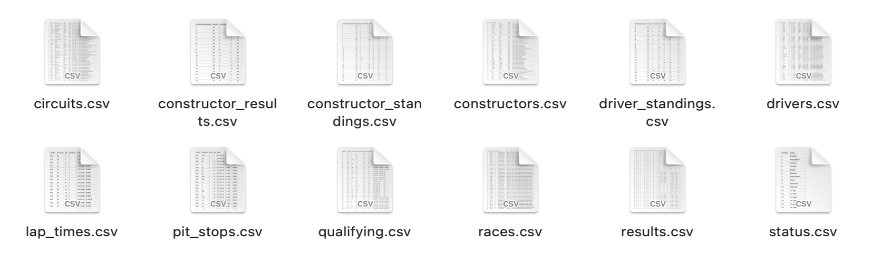

# Data sources


```{r,echo=FALSE}
library(readr)

circuits <- read_csv("data/circuits.csv")
constructor_results <- read_csv("data/constructor_results.csv")
constructor_standings <- read_csv("data/constructor_standings.csv")
constructors <- read_csv("data/constructors.csv")
driver_standings <- read_csv("data/driver_standings.csv")
drivers <- read_csv("data/drivers.csv")
lap_times <- read_csv("data/lap_times.csv")
pit_stops <- read_csv("data/pit_stops.csv")
qualifying <- read_csv("data/qualifying.csv")
races <- read_csv("data/races.csv")
results <- read_csv("data/results.csv")
status <- read_csv("data/status.csv")
```


Sources : <a href="https://ergast.com/mrd/db/">Look at the source website https://ergast.com/mrd/db/</a>

The dataset consists of several files related to Formula one racing sports. The files contain technical information on tracks, races, constructors and drivers. In addition, data and information about the performance of the teams and drivers such as lap times and accidents are available.

<br/>


The data was collected by a simple download. However, there is an API that allows to make GET requests using url in order to get specific data (<a href="https://ergast.com/mrd/"> link </a>).

The data records races, constructor and driver data since 1950. Each record in each file is identified by an unique id allowing to merge the information tables. 

Since most of the plots that shown in the results section is produced by three files, "results.csv", "constructor_standings.csv" and "driver_standings.csv". here we show the first 5 rows of this data file.

```{r,echo=FALSE}
head(results, 5)
```

```{r,echo=FALSE}
head(constructor_standings, 5)
```

```{r,echo=FALSE}
head(driver_standings, 5)
```

We have also more technical information in our data set such as information about lap times:

```{r,echo=FALSE}
head(lap_times, 5)
```
